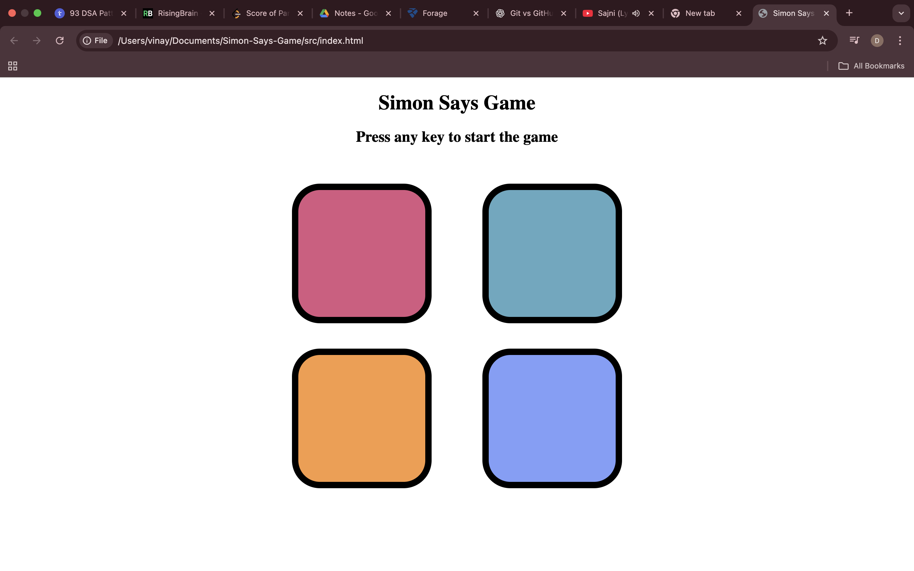
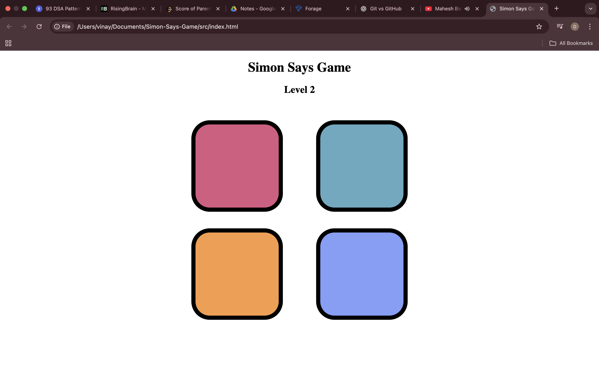
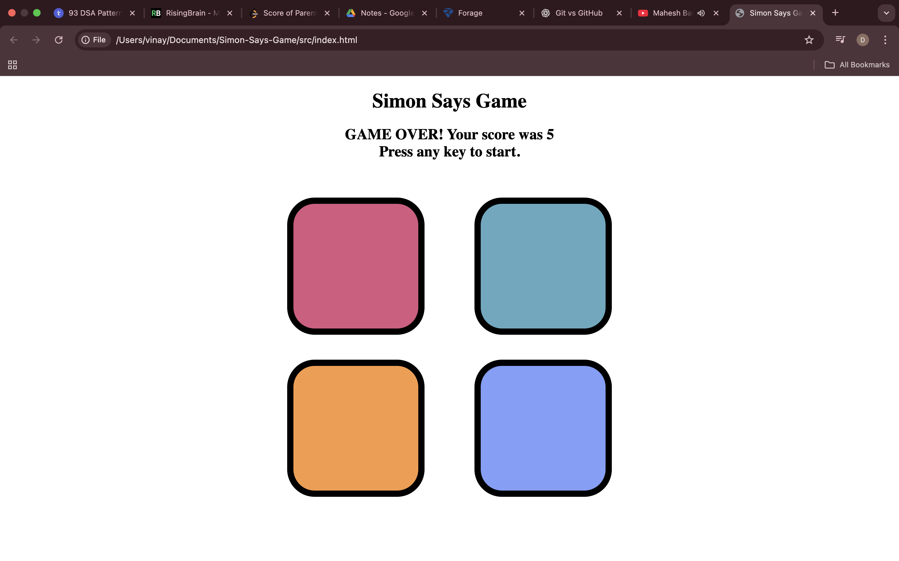

# 🧠 Simon Says Game – Frontend JavaScript Project

A **classic Simon Says memory game** built using **HTML, CSS, and JavaScript**, focusing on **game logic, event handling, and state management**.  
This project demonstrates how interactive browser-based games work using **pure frontend technologies**, without any external libraries, frameworks, or assets.

---

## ✨ Project Overview

The Simon Says Game challenges the player to **memorize and repeat an increasing sequence of colors**.  
With each level, the sequence grows longer, testing the player’s **memory, focus, and reaction accuracy**.

> ⚠️ **Note:**  
> This is a **frontend-only project** with **no backend, APIs, audio files, or external assets**.  
> All visuals and interactions are handled using core web technologies.

---

## 🚀 Features

- 🎮 Keyboard-based game start
- 🔁 Dynamic color sequence generation
- 📈 Progressive difficulty with level tracking
- ❌ Game-over detection with final score display
- 🔄 Instant restart without page reload
- ⚡ Smooth visual feedback using CSS animations

---

## 🛠 Tech Stack

- **HTML5** – Structure & layout
- **CSS3** – Styling & animations
- **JavaScript (ES6)** – Game logic & event handling

---

## 📁 Project Structure
```text
Simon-Says-Game/
│
├── src/
│ ├── index.html
│ ├── style.css
│ └── script.js
│
├── screenshots/
│ ├── start.png
│ ├── level.png
│ └── game-over.png
│
└── README.md
```
## 📸 Screenshots

### 🎮 Game Start Screen

*Initial state prompting the user to begin the game using any key.*

---

### 🔁 Gameplay & Level Progression

*Demonstrates active gameplay with increasing levels and sequence complexity.*

---

### ❌ Game Over & Score Display

*Shows final score after an incorrect input and allows restarting the game.*

---

## ▶️ How to Run Locally

1. Clone the repository:
   ```bash
   git clone https://github.com/your-username/Simon-Says-Game.git

2. Navigate to the project directory:

   cd Simon-Says-Game


3. Open the game:

   Double-click src/index.html
   OR open it in your browser

## 📘 What I Learned

- Building interactive game logic using **JavaScript**
- Managing game state and level progression
- Handling user input through keyboard and click events
- Structuring frontend projects for clarity and scalability

## 👤 Author

**Vinay**  
Aspiring Software Engineer | Frontend Developer  
GitHub: [vinay-d9](https://github.com/vinay-d9)

## ⚠️ Disclaimer

This project is created **solely for educational purposes**.  
It is not affiliated with or endorsed by any commercial product or brand.

No copyright infringement intended.

## ⭐ Acknowledgements

Inspired by the classic **Simon Says** memory game.  
Built as part of my frontend development learning journey.
